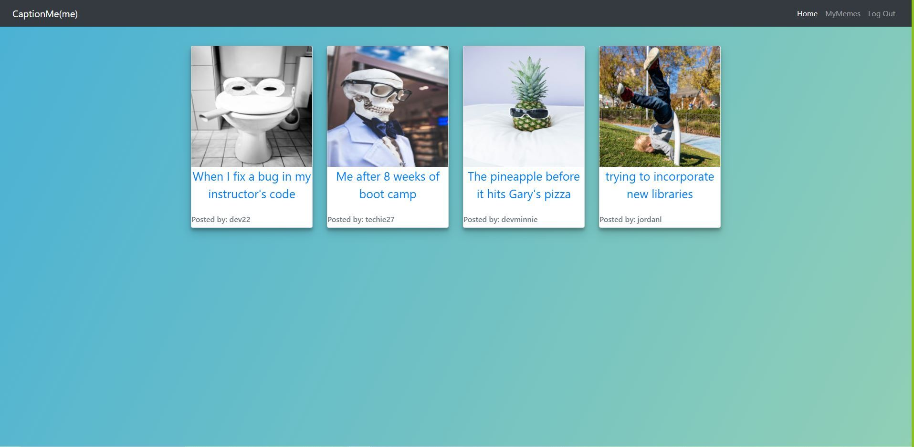

# CaptionMe(me)
Bootcamp Group Project #2

# Professional README Generator

## Description 
We have created a meme generating app called CaptionMe(me) that allows any user to view existing memes. Once signed up and logged in users can comment on existing memes and create their own memes. Users can also update or delete memes they have created.   
    
## Table of Contents

- [Installation](#installation)
- [Usage](#usage)
- [License](#license)
- [Links](#links)
- [Technologies](#technologies) 
- [Contributors](#contributors)
- [Questions](#questions)

## Installation
This application requires Node and users should run "npm install" in their command line prior to use. In addition, use the schema.sql file to build your initial database prior to using the command line tool. 

## Usage
After installing Node and running "npm install" users will open their command line and initiate the program by typing "node server.js". 

## License
This project licensed under the [MIT License](https://opensource.org/licenses/MIT).

## Links
This project is deployed at [this Heroku link](https://captionmeme.herokuapp.com/)

[GitHub repo](https://github.com/jordanlindgren/GroupProject2)

## Technologies
HTML, CSS, Bootstrap, JavaScript, Node.js, Express, Sequelize

Images are sourced from Unsplash and formatted using Cloudinary.

## Contributors
Contributors to the project: Josh Bradley, Laura Hofer, Jordan Lindgren, Jack Theisen.

## Questions
Please contact the contributors on GitHub with any questions. 

